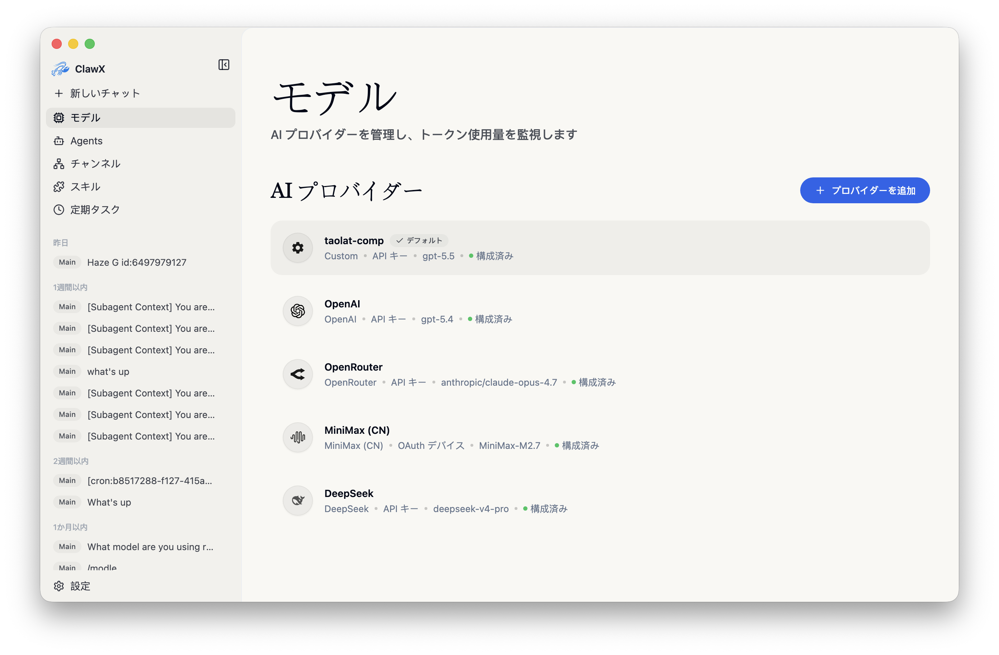

<p align="center">
  
</p>

<h1 align="center">小光 · スマートアシスタント</h1>

<p align="center">
  <strong>中科国光量子 · エンタープライズ向け AI デスクトップクライアント</strong>
</p>

<p align="center">
  <a href="#主な機能">主な機能</a> •
  <a href="#はじめに">はじめに</a> •
  <a href="#アーキテクチャ">アーキテクチャ</a> •
  <a href="#開発">開発</a> •
  <a href="#コントリビューション">コントリビューション</a>
</p>

<p align="center">
  
  
  
  
  
</p>

<p align="center">
  <a href="README.md">English</a> | <a href="README.zh-CN.md">简体中文</a> | 日本語 | <a href="README.ru-RU.md">Русский</a>
</p>

---

## 概要

**小光**は、北京中科国光量子科技有限公司が提供するエンタープライズ向け AI デスクトップクライアントです。主要な大規模言語モデルに接続し、マルチエージェント連携と可視化オーケストレーションに対応します。コマンドラインなしで設定とスケジューリングを完了できます。量子実験プラットフォーム、企業ナレッジベース、豊富な Skills により、AI アシスタントを日常のオフィス業務に組み込めます。

macOS · Windows · Linux に対応し、すぐに利用できます。モバイル（iOS / Android / HarmonyOS）は開発中です。

<p align="center"><strong style="font-size:1.1em; text-decoration: underline;">完全なエンタープライズ版、専用サービスサポート、またはビジネスシナリオに合わせた導入支援が必要な場合は、<a href="mailto:public@ggquanta.ai">public@ggquanta.ai</a> までお問い合わせください。</strong></p>

## スクリーンショット

<table>
  <tr>
    <td align="center"><br><em>チャット</em></td>
    <td align="center"><br><em>スケジュールタスク</em></td>
  </tr>
  <tr>
    <td align="center"><br><em>スキル</em></td>
    <td align="center"><br><em>チャネル</em></td>
  </tr>
  <tr>
    <td align="center"><br><em>モデル</em></td>
    <td align="center"><br><em>設定</em></td>
  </tr>
</table>

## 主な機能

量子実験から知識検索、スキル拡張、オフィス自動化までをカバーする 4 つのモジュールです。

| 機能 | 説明 |
|------|------|
| 量子実験プラットフォーム | 研究ツールを内蔵し、Quafu 量子計算実験プラットフォームをワンクリックで開けます。研究とオフィス作業を同じデスクトップで完結できます。 |
| 企業ナレッジベース | セマンティック検索と設定バインドに対応した Web 画面を内嵌します。社内文書、プロジェクト資料、議事録にすぐアクセスできます。 |
| 豊富な Skills | PDF・Office・検索スキルをプリインストールし、可視化して閲覧・インストール・管理できます。コマンドラインは不要です。 |
| スマートオフィス | マルチエージェント対話、チャネル管理、スケジュール、可視化設定。インストールから最初の AI 対話までグラフィカルです。 |

### ハイライト

- **マルチエージェント対話**：複数セッションのコンテキストと履歴、ストリーミング Markdown、`@agent` による直接ルーティング、インラインスキルカード、思考過程とツール呼び出しの表示切り替え。
- **スキル管理**：ローカル優先のスキルディレクトリ。`pdf`、`xlsx`、`docx`、`pptx` の文書処理スキルを同梱。
- **企業ナレッジベース**：埋め込み検索と設定バインドで、資料と会話をつなぎます。
- **研究ツール**：量子計算実験プラットフォームへの入口。
- **チャネルとスケジュール**：複数アカウントのチャネル、繰り返しまたは 1 回限りのジョブ、外部チャネルへの配信。
- **安全なモデル接続**：OpenAI、Anthropic、Z.AI / GLM などに対応。認証情報は OS のネイティブキーチェーンに保存します。
- **クロスプラットフォーム**：macOS、Windows、Linux に対応。ライト / ダーク / システム同期テーマ。

> 機能の詳細は [docs/ja-JP/features.md](docs/ja-JP/features.md) を参照してください。

### 主なユースケース

- **オフィスアシスタント**：メール作成、文書要約、社内知識の検索をデスクトップから行えます。
- **研究**：同じワークスペースから量子計算実験プラットフォームを開けます。
- **自動化**：監視、要約、通知をスケジュールし、WeChat などのチャネルへ届けます。
- **文書とスキル**：同梱 Skills で PDF / Office を処理し、必要に応じて追加インストールできます。

## はじめに

### システム要件

- **macOS**：11 以上
- **Windows**：10 以上（x64 / ARM64）
- **Linux**：Ubuntu 20.04 以上、または同等のディストリビューション
- **メモリ**：最低 4 GB（8 GB 推奨）
- **ディスク**：約 1 GB の空き容量

### インストール

#### ビルド済みリリース（推奨）

OS と CPU アーキテクチャに合ったインストーラーを製品サイトから入手してください。

**[https://smartx.qubitlab.cc](https://smartx.qubitlab.cc)**

同じビルドは [GitHub Releases](https://github.com/GGquanta/SmartX/releases) からも入手できます。パッケージ選びに迷った場合はサポートまでご連絡ください。

#### ソースからビルド

```bash
# リポジトリをクローン
git clone https://github.com/GGquanta/SmartX.git
cd SmartX

# プロジェクトを初期化
pnpm run init

# 開発モードで起動
pnpm dev
```

### 初回起動

**セットアップウィザード**が次の手順を案内します。

1. **言語と地域** — 使用するロケール
2. **AI プロバイダー** — API キー、または対応プロバイダーでは OAuth
3. **スキルバンドル** — 一般的な用途向けの事前設定スキル
4. **検証** — メイン画面に入る前に設定をテスト

### プロキシ設定

ローカルプロキシ経由で接続する場合は、**設定 → Gateway → プロキシ**で既定プロキシ、バイパスルール、開発者モードでの HTTP / HTTPS / SOCKS 上書きを設定します。ローカル例：`http://127.0.0.1:7890`。

> 詳細は [docs/ja-JP/proxy-settings.md](docs/ja-JP/proxy-settings.md) を参照してください。

## アーキテクチャ

小光はデュアルプロセスのデスクトップアーキテクチャです。Electron Main がウィンドウとシステム統合を担当し、AI オーケストレーションランタイムはアプリ内に埋め込まれます。

- **OpenClaw 内蔵**：公式コアを埋め込み、別途ランタイムを入れる必要はありません。
- **クロスプラットフォーム**：macOS、Windows、Linux を 1 つのクライアントでカバーします。
- **キーチェーン保存**：プロバイダー認証情報は OS ネイティブのキーチェーンに保存します。
- **Gateway の自動管理**：Gateway のライフサイクルはアプリが管理します。

> 詳細は [docs/ja-JP/architecture.md](docs/ja-JP/architecture.md) を参照してください。

## 開発

リポジトリの開発コードネームは **SmartX** です。

### 前提条件

- **Node.js**：22.22.3 以上、24.15.0 以上、または 25.9.0 以上（Node 24 LTS 推奨）
- **パッケージマネージャー**：pnpm 9 以上
- **Linux（Ubuntu/Debian）**：Electron 実行前に必要なシステムライブラリをインストールしてください。詳細は [docs/ja-JP/development.md](docs/ja-JP/development.md)。

### よく使うコマンド

```bash
pnpm run init        # 依存関係をインストールし、バンドルランタイムをダウンロード
pnpm dev             # ホットリロード付きで開発モードを起動
pnpm lint            # ESLint を実行
pnpm typecheck       # TypeScript を検証
pnpm test            # ユニットテストを実行
pnpm run test:e2e    # Electron E2E スモークテストを実行
pnpm build           # 本番ビルドを実行
pnpm package         # 現在のプラットフォーム向けにパッケージ化（:mac / :win / :linux）
```

> プロジェクト構成と完全なコマンド一覧は [docs/ja-JP/development.md](docs/ja-JP/development.md) を参照してください。

## コントリビューション

バグ修正、新機能、ドキュメント、翻訳などの貢献を歓迎します。

1. リポジトリを**フォーク**する
2. フィーチャーブランチを**作成**する（`git checkout -b feature/amazing-feature`）
3. 明確なメッセージで**コミット**し、Pull Request を作成する

既存のコードスタイル（ESLint + Prettier）に従い、新機能にはテストを追加し、必要に応じてドキュメントを更新してください。

## 謝辞

小光は次のオープンソースプロジェクトの上に構築されています。

- [OpenClaw](https://github.com/OpenClaw) - AI エージェントランタイム
- [Electron](https://www.electronjs.org/) - クロスプラットフォームデスクトップフレームワーク
- [React](https://react.dev/) - UI コンポーネントライブラリ
- [shadcn/ui](https://ui.shadcn.com/) - 美しく設計されたコンポーネント
- [Zustand](https://github.com/pmndrs/zustand) - 軽量な状態管理

## ライセンス

本ソフトウェアは [MIT ライセンス](LICENSE) のもとで公開されています。自由に使用、変更、配布できます。

<hr>

<p align="center">
  <sub>北京中科国光量子科技有限公司が ❤️ を込めて開発</sub>
</p>
