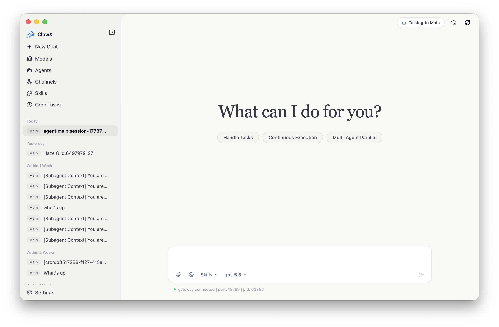
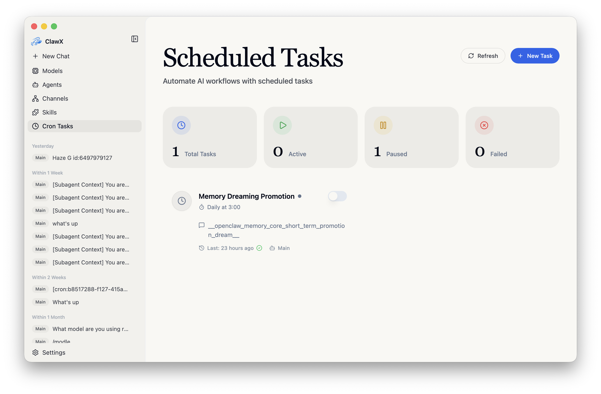

<p align="center">
  
</p>

<h1 align="center">小光 · Intelligent Assistant</h1>

<p align="center">
  <strong>CAS Guoguang Quantum · Enterprise AI Desktop Client</strong>
</p>

<p align="center">
  <a href="#core-capabilities">Core Capabilities</a> •
  <a href="#getting-started">Getting Started</a> •
  <a href="#architecture">Architecture</a> •
  <a href="#development">Development</a> •
  <a href="#contributing">Contributing</a>
</p>

<p align="center">
  
  
  
  
  
</p>

<p align="center">
  English | <a href="README.zh-CN.md">简体中文</a> | <a href="README.ja-JP.md">日本語</a> | <a href="README.ru-RU.md">Русский</a>
</p>

---

## Overview

**Xiaoguang** (小光) is the enterprise AI desktop client from Beijing Zhongke Guoguang Quantum Technology Co., Ltd. It connects to mainstream large language models, supports multi-agent collaboration and visual orchestration, and lets you configure and schedule everything without a command line. Quantum experiment platforms, an enterprise knowledge base, and a rich Skills catalog bring AI into everyday office work.

Available today on macOS · Windows · Linux. Mobile (iOS / Android / HarmonyOS) is in development.

<p align="center"><strong style="font-size:1.1em; text-decoration: underline;">For a full enterprise edition, dedicated service support, or tailored deployment guidance, contact us at <a href="mailto:public@ggquanta.ai">public@ggquanta.ai</a>.</strong></p>

## Screenshots

<table>
  <tr>
    <td align="center"><br><em>Chat</em></td>
    <td align="center"><br><em>Scheduled tasks</em></td>
  </tr>
  <tr>
    <td align="center"><br><em>Skills</em></td>
    <td align="center"><br><em>Channels</em></td>
  </tr>
  <tr>
    <td align="center"><br><em>Models</em></td>
    <td align="center"><br><em>Settings</em></td>
  </tr>
</table>

## Core Capabilities

Four modules cover the workflow from quantum experiments to knowledge retrieval, skill expansion, and office automation.

| Capability | Description |
|------------|-------------|
| Quantum experiment platform | Built-in research tools with one-click access to the Quafu quantum computing platform. Research and office work share the same desktop. |
| Enterprise knowledge base | Embedded knowledge-base UI with semantic search and configuration binding. Company docs, project files, and meeting notes are a click away. |
| Rich Skills catalog | Pre-installed PDF, Office, and search skills with visual browse, install, and management. Extend agents without a command line. |
| Intelligent office | Multi-agent chat, channel management, scheduled tasks, and visual settings. Graphical setup from install to first AI conversation. |

### Highlights

- **Multi-agent chat**: Multi-session context and history, streaming Markdown, direct `@agent` routing, and inline skill cards.
- **Skill management**: Local-first skill directories with visual browse, install, and path management; bundled document skills for `pdf`, `xlsx`, `docx`, and `pptx`.
- **Enterprise knowledge base**: Embedded search and config binding that connect office materials to conversations.
- **Research tools**: Entry point to the quantum computing experiment platform.
- **Channels and schedules**: Multi-account channels, recurring or one-time jobs, and delivery to external channels.
- **Secure model access**: OpenAI, Anthropic, Z.AI / GLM, and more, with credentials stored in the native system keychain.
- **Cross-platform desktop**: macOS, Windows, and Linux out of the box; light, dark, or system-synced themes.

> For full feature details, see [docs/en-US/features.md](docs/en-US/features.md).

### Typical Use Cases

- **Office assistant**: Draft email, summarize documents, and search internal knowledge from a desktop client.
- **Research**: Open the quantum computing experiment platform without leaving the same workspace.
- **Automation**: Schedule monitoring, summaries, and notifications delivered to WeChat and other channels.
- **Documents and skills**: Process PDF / Office files with bundled skills, and install more as needed.

## Getting Started

### System Requirements

- **macOS**: 11 or later
- **Windows**: 10 or later
- **Linux**: Ubuntu 20.04+ or equivalent
- **Memory**: 4 GB minimum (8 GB recommended)
- **Disk**: about 1 GB free space

### Installation

#### Pre-built Releases (Recommended)

Download the installer that matches your OS and CPU architecture from the product site:

**[https://smartx.qubitlab.cc](https://smartx.qubitlab.cc)**

The same builds are also available from [GitHub Releases](https://github.com/GGquanta/SmartX/releases). Contact support if you need help choosing a package.

#### Build from Source

```bash
# Clone the repository
git clone https://github.com/GGquanta/SmartX.git
cd SmartX

# Initialize the project
pnpm run init

# Start in development mode
pnpm dev
```

### First Launch

The **Setup Wizard** guides you through:

1. **Language & Region** — preferred locale
2. **AI Provider** — API keys or OAuth where supported
3. **Skill Bundles** — pre-configured skills for common tasks
4. **Verification** — test the configuration before entering the main UI

### Proxy Settings

For access through a local proxy, open **Settings → Gateway → Proxy** to set the default proxy, bypass rules, and optional developer-mode HTTP / HTTPS / SOCKS overrides. A local example is `http://127.0.0.1:7890`.

> See [docs/en-US/proxy-settings.md](docs/en-US/proxy-settings.md) for details.

## Architecture

Xiaoguang uses a dual-process desktop architecture: Electron Main owns the window and system integration, and the AI orchestration runtime is embedded in the app.

- **OpenClaw built in**: Official core is embedded; no separate runtime install.
- **Cross-platform desktop**: One client for macOS, Windows, and Linux.
- **Keychain storage**: Provider credentials stay in the native OS keychain.
- **Automatic Gateway management**: Gateway lifecycle is owned by the app.

> For the full architecture notes, see [docs/en-US/architecture.md](docs/en-US/architecture.md).

## Development

The repository development codename is **SmartX**.

### Prerequisites

- **Node.js**: 22.22.3+, 24.15.0+, or 25.9.0+ (Node 24 LTS recommended)
- **Package Manager**: pnpm 9+
- **Linux (Ubuntu/Debian)**: Install required system libraries before running Electron; see [docs/en-US/development.md](docs/en-US/development.md)

### Common Commands

```bash
pnpm run init        # Install dependencies and download bundled runtimes
pnpm dev             # Start in development mode with hot reload
pnpm lint            # Run ESLint
pnpm typecheck       # TypeScript validation
pnpm test            # Run unit tests
pnpm run test:e2e    # Run Electron E2E smoke tests
pnpm build           # Full production build
pnpm package         # Package for the current platform (:mac / :win / :linux)
```

> For project structure and the full command list, see [docs/en-US/development.md](docs/en-US/development.md).

## Contributing

Bug fixes, features, docs, and translations are all welcome.

1. **Fork** the repository
2. **Create** a feature branch (`git checkout -b feature/amazing-feature`)
3. **Commit** with clear messages and open a Pull Request

Follow the existing code style (ESLint + Prettier), add tests for new behavior, and update docs when needed.

## Acknowledgments

Xiaoguang is built on excellent open-source projects:

- [OpenClaw](https://github.com/OpenClaw) - AI agent runtime
- [Electron](https://www.electronjs.org/) - Cross-platform desktop framework
- [React](https://react.dev/) - UI component library
- [shadcn/ui](https://ui.shadcn.com/) - Beautifully designed components
- [Zustand](https://github.com/pmndrs/zustand) - Lightweight state management

## License

Released under the [MIT License](LICENSE). You are free to use, modify, and distribute this software.

<hr>

<p align="center">
  <sub>Built with ❤️ by Beijing Zhongke Guoguang Quantum Technology Co., Ltd.</sub>
</p>
