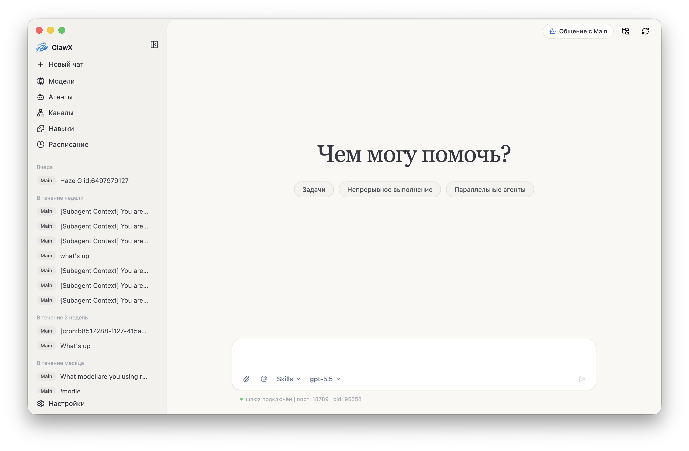
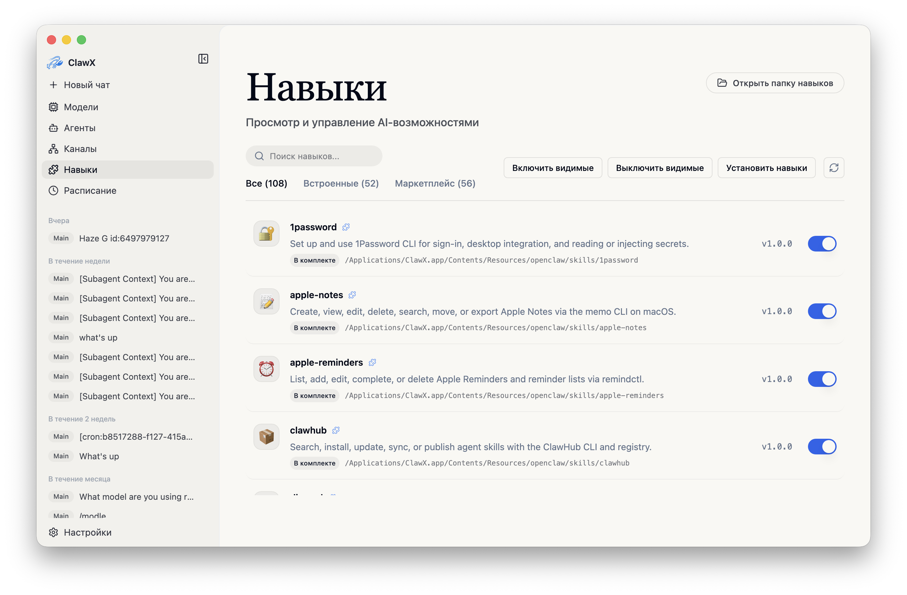
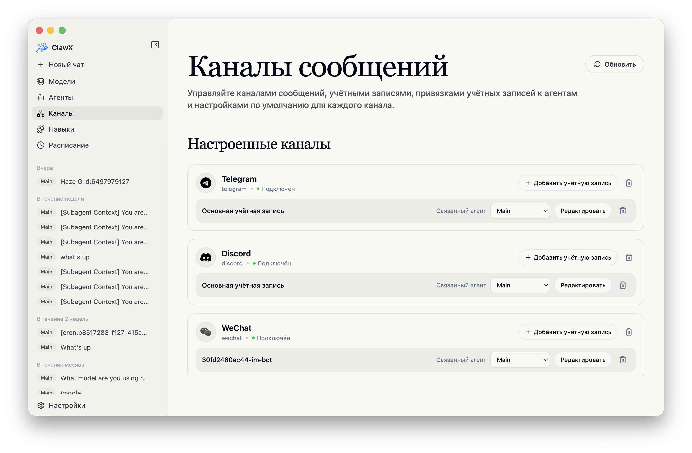
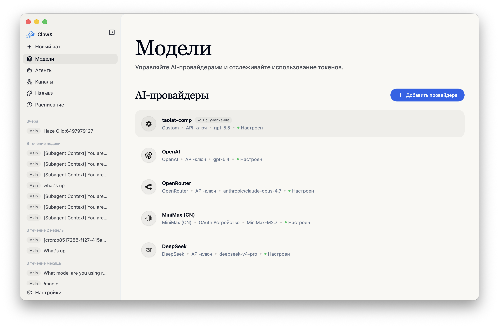
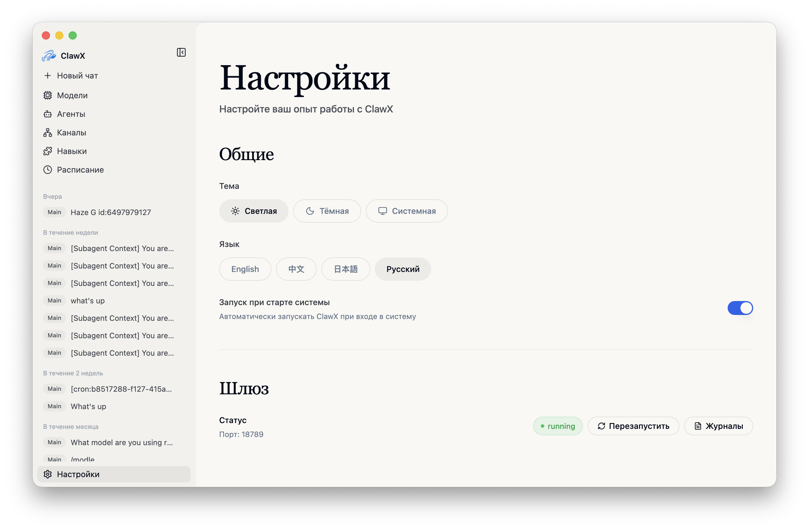

<p align="center">
  
</p>

<h1 align="center">小光 · Интеллектуальный ассистент</h1>

<p align="center">
  <strong>CAS Guoguang Quantum · Корпоративный AI-десктоп-клиент</strong>
</p>

<p align="center">
  <a href="#основные-возможности">Основные возможности</a> •
  <a href="#быстрый-старт">Быстрый старт</a> •
  <a href="#архитектура">Архитектура</a> •
  <a href="#разработка">Разработка</a> •
  <a href="#участие">Участие</a>
</p>

<p align="center">
  
  
  
  
  
</p>

<p align="center">
  <a href="README.md">English</a> | <a href="README.zh-CN.md">简体中文</a> | <a href="README.ja-JP.md">日本語</a> | Русский
</p>

---

## Обзор

**Сяогуан** (小光) — корпоративный AI-десктоп-клиент компании Beijing Zhongke Guoguang Quantum Technology Co., Ltd. Он подключается к основным большим языковым моделям, поддерживает сотрудничество нескольких агентов и визуальную оркестрацию — настройка и планирование не требуют командной строки. Платформа квантовых экспериментов, корпоративная база знаний и каталог Skills помогают встроить ИИ в повседневную офисную работу.

Доступен на macOS · Windows · Linux. Мобильные версии (iOS / Android / HarmonyOS) находятся в разработке.

<p align="center"><strong style="font-size:1.1em; text-decoration: underline;">Для полной корпоративной версии, специализированной поддержки или индивидуального сопровождения внедрения свяжитесь с нами по адресу <a href="mailto:public@ggquanta.ai">public@ggquanta.ai</a>.</strong></p>

## Скриншоты

<table>
  <tr>
    <td align="center"><br><em>Чат</em></td>
    <td align="center"><br><em>Запланированные задачи</em></td>
  </tr>
  <tr>
    <td align="center"><br><em>Навыки</em></td>
    <td align="center"><br><em>Каналы</em></td>
  </tr>
  <tr>
    <td align="center"><br><em>Модели</em></td>
    <td align="center"><br><em>Настройки</em></td>
  </tr>
</table>

## Основные возможности

Четыре модуля охватывают путь от квантовых экспериментов до поиска знаний, расширения навыков и офисной автоматизации.

| Возможность | Описание |
|-------------|----------|
| Платформа квантовых экспериментов | Встроенные исследовательские инструменты и доступ к платформе квантовых вычислений Quafu в один клик. Исследования и офис — на одном рабочем столе. |
| Корпоративная база знаний | Встроенный веб-интерфейс с семантическим поиском и привязкой конфигурации. Документы компании, материалы проектов и протоколы встреч всегда под рукой. |
| Каталог Skills | Предустановленные навыки для PDF, Office и поиска; визуальный просмотр, установка и управление без командной строки. |
| Интеллектуальный офис | Чат с несколькими агентами, каналы, расписания и визуальные настройки. Графический путь от установки до первого диалога с ИИ. |

### Особенности

- **Чат с несколькими агентами**: несколько сессий и история, потоковый Markdown, прямая маршрутизация `@agent` и встроенные карточки навыков.
- **Управление навыками**: локальные каталоги с визуальным просмотром и установкой; навыки обработки документов `pdf`, `xlsx`, `docx`, `pptx`.
- **Корпоративная база знаний**: встроенный поиск и привязка конфигурации, связывающие материалы с диалогами.
- **Исследовательские инструменты**: вход на платформу квантовых вычислительных экспериментов.
- **Каналы и расписания**: несколько аккаунтов, повторяющиеся или разовые задания, доставка во внешние каналы.
- **Безопасное подключение моделей**: OpenAI, Anthropic, Z.AI / GLM и другие; учётные данные хранятся в системном хранилище ключей.
- **Кроссплатформенный десктоп**: macOS, Windows и Linux из коробки; светлая, тёмная или системная тема.

> Полное описание возможностей — в [docs/ru-RU/features.md](docs/ru-RU/features.md).

### Типичные сценарии

- **Офисный ассистент**: черновики писем, резюме документов и поиск внутренних знаний с рабочего стола.
- **Исследования**: открытие платформы квантовых экспериментов в том же рабочем пространстве.
- **Автоматизация**: мониторинг, сводки и уведомления по расписанию с доставкой в WeChat и другие каналы.
- **Документы и навыки**: обработка PDF / Office встроенными Skills и установка дополнительных навыков по необходимости.

## Быстрый старт

### Системные требования

- **macOS**: 11 или новее
- **Windows**: 10 или новее (x64 / ARM64)
- **Linux**: Ubuntu 20.04+ или эквивалентный дистрибутив
- **Память**: минимум 4 ГБ (рекомендуется 8 ГБ)
- **Диск**: около 1 ГБ свободного места

### Установка

#### Готовые релизы (рекомендуется)

Скачайте установщик, соответствующий ОС и архитектуре процессора, с сайта продукта:

**[https://smartx.qubitlab.cc](https://smartx.qubitlab.cc)**

Те же сборки доступны на [GitHub Releases](https://github.com/GGquanta/SmartX/releases). Если нужна помощь с выбором пакета, обратитесь в поддержку.

#### Сборка из исходников

```bash
# Клонирование репозитория
git clone https://github.com/GGquanta/SmartX.git
cd SmartX

# Инициализация проекта
pnpm run init

# Запуск в режиме разработки
pnpm dev
```

### Первый запуск

**Мастер настройки** проведёт вас через следующие шаги:

1. **Язык и регион** — предпочитаемая локаль
2. **AI-провайдер** — API-ключи или OAuth, если поддерживается
3. **Пакеты навыков** — предустановленные навыки для типичных задач
4. **Проверка** — тестирование конфигурации перед входом в основной интерфейс

### Настройки прокси

Для доступа через локальный прокси откройте **Настройки → Gateway → Прокси** и задайте прокси по умолчанию, правила обхода и дополнительные переопределения HTTP / HTTPS / SOCKS в режиме разработчика. Пример: `http://127.0.0.1:7890`.

> Подробности см. в [docs/ru-RU/proxy-settings.md](docs/ru-RU/proxy-settings.md).

## Архитектура

Сяогуан использует двухпроцессную десктоп-архитектуру: Electron Main отвечает за окно и системную интеграцию, а среда оркестрации ИИ встроена в приложение.

- **OpenClaw встроен**: официальное ядро встроено, отдельная установка среды выполнения не нужна.
- **Кроссплатформенный десктоп**: один клиент для macOS, Windows и Linux.
- **Хранение в связке ключей**: учётные данные провайдеров остаются в системном хранилище ключей.
- **Автоматическое управление Gateway**: жизненным циклом шлюза управляет приложение.

> Полное описание архитектуры — в [docs/ru-RU/architecture.md](docs/ru-RU/architecture.md).

## Разработка

Кодовое имя разработки репозитория — **SmartX**.

### Требования

- **Node.js**: 22.22.3+, 24.15.0+ или 25.9.0+ (рекомендуется Node 24 LTS)
- **Менеджер пакетов**: pnpm 9+
- **Linux (Ubuntu/Debian)**: перед запуском Electron установите необходимые системные библиотеки; см. [docs/ru-RU/development.md](docs/ru-RU/development.md)

### Основные команды

```bash
pnpm run init        # Установить зависимости и скачать встроенные среды выполнения
pnpm dev             # Запустить режим разработки с горячей перезагрузкой
pnpm lint            # Запустить ESLint
pnpm typecheck       # Проверить типы TypeScript
pnpm test            # Запустить модульные тесты
pnpm run test:e2e    # Запустить дымовые E2E-тесты Electron
pnpm build           # Выполнить полную production-сборку
pnpm package         # Упаковать для текущей платформы (:mac / :win / :linux)
```

> Структура проекта и полный список команд описаны в [docs/ru-RU/development.md](docs/ru-RU/development.md).

## Участие

Исправления ошибок, новые функции, документация и переводы приветствуются.

1. **Сделайте форк** репозитория
2. **Создайте** ветку функции (`git checkout -b feature/amazing-feature`)
3. **Зафиксируйте** изменения с понятными сообщениями и откройте Pull Request

Следуйте существующему стилю кода (ESLint + Prettier), пишите тесты для нового поведения и обновляйте документацию при необходимости.

## Благодарности

Сяогуан построен на следующих проектах с открытым исходным кодом:

- [OpenClaw](https://github.com/OpenClaw) - Среда выполнения AI-агентов
- [Electron](https://www.electronjs.org/) - Кроссплатформенный десктоп-фреймворк
- [React](https://react.dev/) - Библиотека UI-компонентов
- [shadcn/ui](https://ui.shadcn.com/) - Красиво спроектированные компоненты
- [Zustand](https://github.com/pmndrs/zustand) - Лёгкое управление состоянием

## Лицензия

Выпускается под [лицензией MIT](LICENSE). Вы можете свободно использовать, изменять и распространять это программное обеспечение.

<hr>

<p align="center">
  <sub>Создано с ❤️ компанией Beijing Zhongke Guoguang Quantum Technology Co., Ltd.</sub>
</p>
