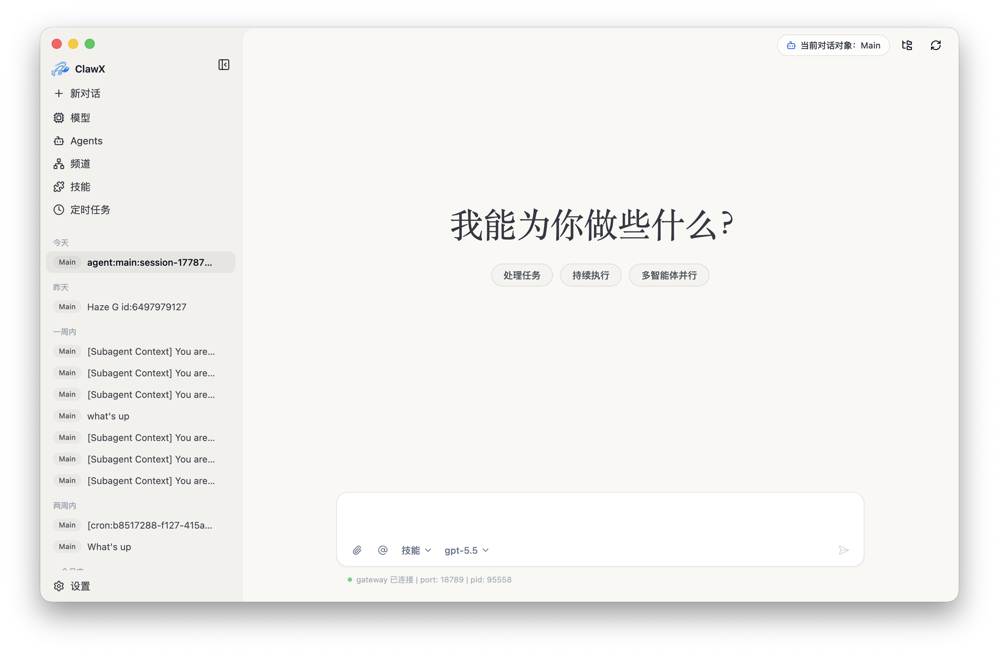
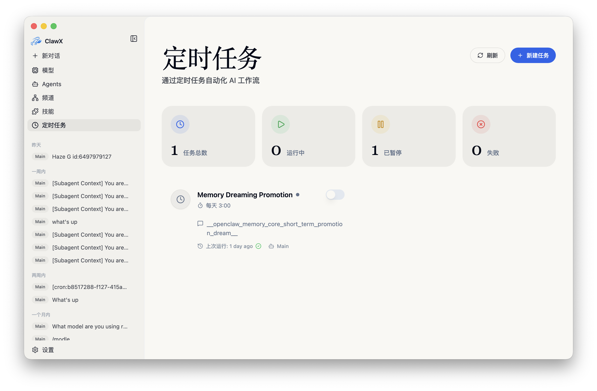
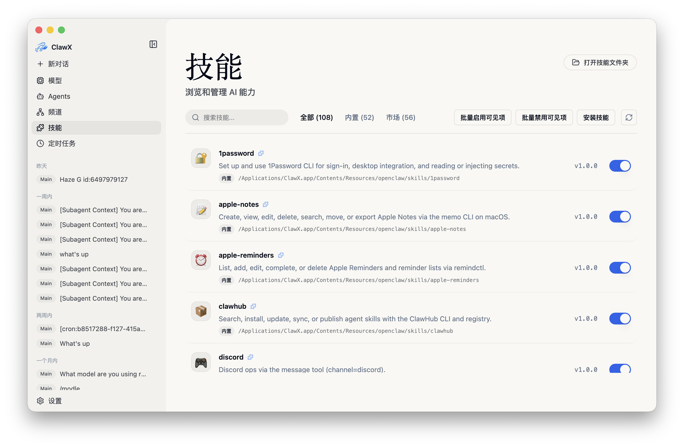
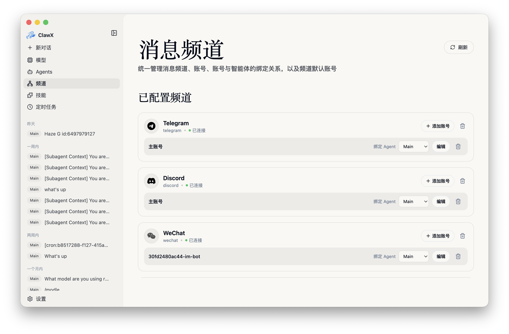
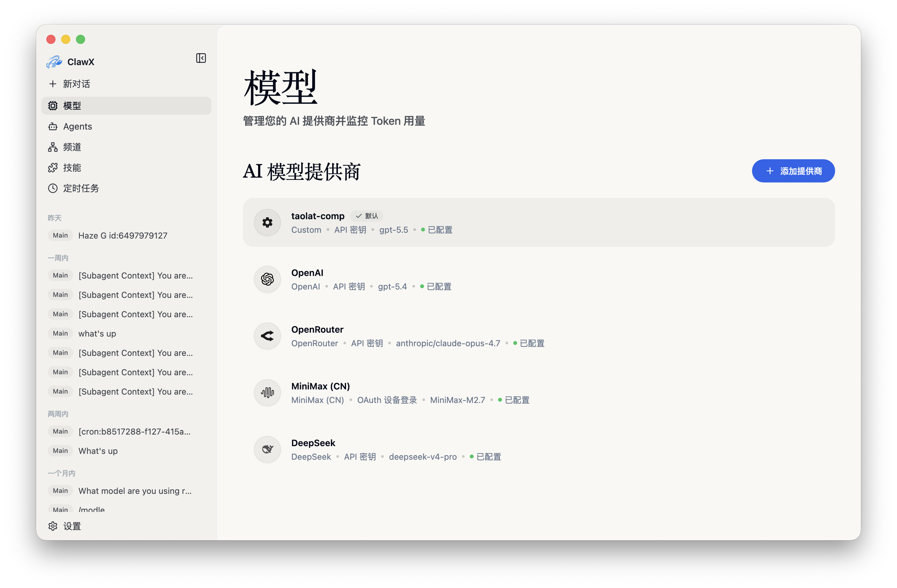
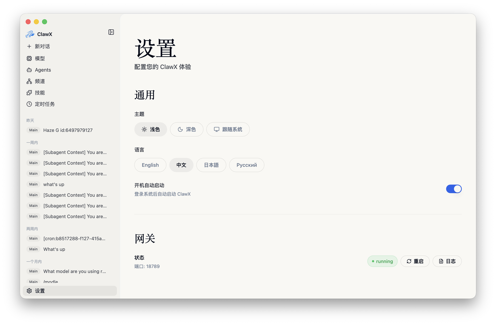

<p align="center">
  
</p>

<h1 align="center">小光 · 智能助理</h1>

<p align="center">
  <strong>中科国光量子 · 企业级 AI 桌面客户端</strong>
</p>

<p align="center">
  <a href="#核心能力">核心能力</a> •
  <a href="#快速上手">快速上手</a> •
  <a href="#系统架构">系统架构</a> •
  <a href="#开发指南">开发指南</a> •
  <a href="#参与贡献">参与贡献</a>
</p>

<p align="center">
  
  
  
  
  
</p>

<p align="center">
  <a href="README.md">English</a> | 简体中文 | <a href="README.ja-JP.md">日本語</a> | <a href="README.ru-RU.md">Русский</a>
</p>

---

## 概述

**小光** 是北京中科国光量子科技有限公司推出的企业级 AI 桌面客户端。对接主流大语言模型，支持多智能体协作与可视化编排，无需命令行即可完成配置与调度。接入量子实验平台、企业知识库与海量 Skills，让 AI 助手真正融入日常办公。

支持 macOS · Windows · Linux，开箱即用。移动端（iOS / Android / 鸿蒙）开发中。

<p align="center"><strong style="font-size:1.1em; text-decoration: underline;">如需完整的企业版、专属服务支持或面向您业务场景的定制化落地辅导，请联系 <a href="mailto:public@ggquanta.ai">public@ggquanta.ai</a>。</strong></p>

## 截图预览

<table>
  <tr>
    <td align="center"><br><em>聊天界面</em></td>
    <td align="center"><br><em>定时任务</em></td>
  </tr>
  <tr>
    <td align="center"><br><em>技能管理</em></td>
    <td align="center"><br><em>频道管理</em></td>
  </tr>
  <tr>
    <td align="center"><br><em>模型配置</em></td>
    <td align="center"><br><em>设置</em></td>
  </tr>
</table>

## 核心能力

四大能力模块，覆盖从量子实验到知识检索、技能扩展与自动化办公的完整工作流。

| 能力 | 说明 |
|------|------|
| 量子实验平台接入 | 内置科研工具入口，一键打开 Quafu 量子计算实验平台。科研探索与日常办公在同一桌面完成。 |
| 企业知识库访问 | 内嵌企业知识库 Web 界面，支持语义检索与配置绑定。公司文档、项目资料与会议纪要触手可及。 |
| 海量 Skills 支持 | 预装 PDF、Office 文档处理与搜索类技能，可视化浏览、安装与管理。扩展 Agent 能力无需命令行。 |
| 智能化办公 | 多 Agent 对话、频道管理、定时任务与可视化设置。从安装到首次 AI 交互，全程图形界面。 |

### 功能亮点

- **多 Agent 智能对话**：多会话上下文与历史记录，流式 Markdown 渲染，`@agent` 直接路由与技能内联卡片。
- **技能管理**：本地优先的技能目录，可视化浏览、安装与路径管理；预装文档处理技能（`pdf`、`xlsx`、`docx`、`pptx`）。
- **企业知识库**：内嵌检索与配置绑定，办公资料与对话工作流打通。
- **科研工具**：量子计算实验平台入口，科研与办公共用同一客户端。
- **频道与定时任务**：多频道、多账号配置，周期或单次调度，结果可投递到外部频道。
- **安全的模型接入**：对接 OpenAI、Anthropic、Z.AI / GLM 等供应商，凭证保存在系统原生密钥链。
- **跨平台桌面**：macOS、Windows、Linux 开箱即用；浅色 / 深色 / 跟随系统主题。

> 功能细节请参阅 [docs/zh-CN/features.md](docs/zh-CN/features.md)。

### 典型使用场景

- **企业办公助理**：起草邮件、总结文档、检索内部知识，在桌面完成日常办公。
- **科研探索**：通过内置入口访问量子计算实验平台，文献、实验与办公在同一工作台进行。
- **自动化调度**：定时监控、汇总与通知，结果投递到微信等频道。
- **文档与技能扩展**：用预装 Skills 处理 PDF / Office 文件，并按需安装更多技能。

## 快速上手

### 系统要求

- **macOS**：11 或更高版本
- **Windows**：10 或更高版本
- **Linux**：Ubuntu 20.04+ 或同等发行版
- **内存**：最低 4 GB（推荐 8 GB）
- **磁盘**：约 1 GB 可用空间

### 安装方式

#### 预构建版本（推荐）

前往官网下载页选择与操作系统和处理器架构匹配的安装包：

**[https://smartx.qubitlab.cc](https://smartx.qubitlab.cc)**

也可从 [GitHub Releases](https://github.com/GGquanta/SmartX/releases) 获取相同版本。如有疑问，可联系技术支持。

#### 从源码构建

```bash
# 克隆仓库
git clone https://github.com/GGquanta/SmartX.git
cd SmartX

# 初始化项目
pnpm run init

# 以开发模式启动
pnpm dev
```

### 首次启动

首次启动时，**设置向导** 将引导你完成：

1. **语言与区域** – 配置首选语言和地区
2. **AI 供应商** – 通过 API 密钥或 OAuth 添加账号
3. **技能包** – 选择适用于常见场景的预配置技能
4. **验证** – 在进入主界面前测试配置

### 代理设置

如需通过本地代理访问外网，打开 **设置 → 网关 → 代理**，配置默认代理、绕过规则，以及开发者模式下的 HTTP / HTTPS / SOCKS 覆盖。本地示例：`http://127.0.0.1:7890`。

> 详细行为说明请参阅 [docs/zh-CN/proxy-settings.md](docs/zh-CN/proxy-settings.md)。

## 系统架构

小光采用双进程桌面架构：图形界面与系统集成由 Electron 主进程负责，AI 编排运行时内置于应用中，开箱即用。

- **OpenClaw 内置**：官方核心嵌入，无需单独安装运行时。
- **跨平台桌面**：同一套客户端覆盖 macOS、Windows 与 Linux。
- **密钥链存储**：AI 供应商凭证保存在系统原生密钥链。
- **Gateway 自动管理**：网关生命周期由应用托管，无需手动维护。

> 完整架构说明请参阅 [docs/zh-CN/architecture.md](docs/zh-CN/architecture.md)。

## 开发指南

仓库开发代号为 **SmartX**。

### 前置要求

- **Node.js**：22.22.3+ / 24.15.0+（推荐） / 25.9.0+
- **包管理器**：pnpm 9+
- **Linux（Ubuntu/Debian）**：运行 Electron 前需先安装系统库，见 [docs/zh-CN/development.md](docs/zh-CN/development.md)

### 常用命令

```bash
pnpm run init        # 初始化开发环境（安装依赖并下载捆绑运行时）
pnpm dev             # 以热重载模式启动
pnpm lint            # ESLint 检查
pnpm typecheck       # TypeScript 类型检查
pnpm test            # 单元测试
pnpm run test:e2e    # Electron E2E 冒烟测试
pnpm build           # 完整生产构建
pnpm package         # 为当前平台打包（可用 :mac / :win / :linux 后缀）
```

> 项目结构、技术栈与完整命令列表请参阅 [docs/zh-CN/development.md](docs/zh-CN/development.md)。

## 参与贡献

欢迎提交问题修复、功能改进与文档更新。

1. **Fork** 本仓库
2. **创建** 功能分支（`git checkout -b feature/amazing-feature`）
3. **提交** 清晰描述的变更并创建 Pull Request

请遵循现有代码风格（ESLint + Prettier），为新功能编写测试，并按需更新文档。

## 致谢

小光构建于以下开源项目之上：

- [OpenClaw](https://github.com/OpenClaw) – AI 智能体运行时
- [Electron](https://www.electronjs.org/) – 跨平台桌面框架
- [React](https://react.dev/) – UI 组件库
- [shadcn/ui](https://ui.shadcn.com/) – 精美设计的组件库
- [Zustand](https://github.com/pmndrs/zustand) – 轻量级状态管理

## 许可证

本软件基于 [MIT 许可证](LICENSE) 发布。你可以自由地使用、修改和分发。

<hr>

<p align="center">
  <sub>由北京中科国光量子科技有限公司用 ❤️ 打造</sub>
</p>
